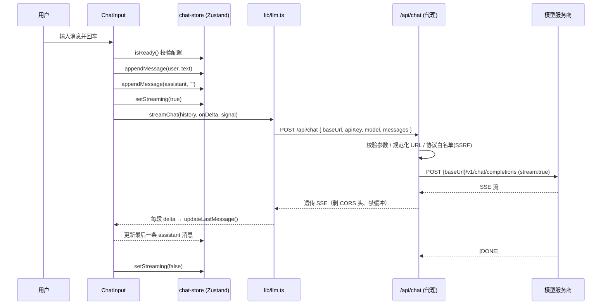

# PROMPT.md — chatbot-demo 逆向分析文档

> 通过逆向分析 `chatbot-demo` 源码、配置与注释，还原其设计意图、模块职责与运行机制。
> 本文件可作为「如何向 AI 描述/复刻本项目」的提示词底稿。

---

## 1. 项目定位

**一句话定位**：一个 BYOK（Bring Your Own Key）的简易版 Chatbot 网页应用，用户只需配置三项参数（Base URL / API Key / Model ID）即可连接任意 OpenAI 兼容服务进行多轮流式对话。

**设计哲学**：是 [ChatGPTNextWeb/NextChat](https://github.com/ChatGPTNextWeb/NextChat) 的**极简裁剪版** —— 去掉用户系统、插件系统、多模型管理，只保留「聊天 + 配置 + 本地历史」三个核心能力。

**目标用户**：计算机课程学生 / 想快速拥有一个私有聊天前端的开发者 / 教学演示场景。

---

## 2. 核心功能

| 功能 | 说明 |
|------|------|
| 多轮对话 | 新建/切换/删除会话，历史消息本地持久化 |
| 流式响应 | SSE 逐字输出，支持「停止生成」（AbortController） |
| BYOK 配置 | 三项参数：`baseUrl` / `apiKey` / `model` |
| 连接测试 | 发送 `ping` 消息验证连通性与模型可用性 |
| Markdown 渲染 | 代码块、表格、LaTeX 风格排版（react-markdown + remark-gfm） |
| 会话导出 | 单个会话导出 JSON / 全部会话导出 JSON |
| Token 统计 | 本地启发式估算，按会话排行展示 |

---

## 3. 技术栈

| 分类 | 选型 | 版本 | 用途 |
|------|------|------|------|
| 框架 | Next.js (App Router) | 14.2.35 | 前后端一体、路由、API 代理 |
| UI | React | 18.3.1 | 组件化界面 |
| 语言 | TypeScript | ^5.5.3 | 类型安全 |
| 样式 | Tailwind CSS | ^3.4.7 | 原子化样式（夜间控制台主题） |
| 状态 | Zustand | ^4.5.5 | 全局状态 + persist 持久化 |
| Markdown | react-markdown + remark-gfm | ^9 / ^4 | 助手消息渲染 |
| 字体 | next/font (Space Grotesk / IBM Plex Sans / IBM Plex Mono) | 内置 | 品牌排版 |

---

## 4. 关键模块职责

```
app/                          # Next.js App Router 层
├── layout.tsx                # 根布局：加载字体、注入 globals.css
├── page.tsx                  # 根路由：useEffect 重定向 → /chat
├── chat/page.tsx             # 聊天页：无会话时自动创建
├── settings/page.tsx         # 设置页：Sidebar + SettingsPanel
├── stats/page.tsx            # 统计页：Sidebar + StatsPanel
└── api/chat/route.ts         # ★ 后端代理：转发 LLM 请求（流式/错误/超时/SSRF 校验）

components/
├── chat/                     # 聊天区
│   ├── ChatWindow.tsx        # 状态栏 + 会话导出按钮 + 组合列表与输入
│   ├── MessageList.tsx       # 消息滚动容器 + 空态「终端欢迎屏」
│   ├── MessageItem.tsx       # 单条消息：用户 ❯ 提示 / 助手「终端窗口」卡片
│   └── ChatInput.tsx         # 控制台式输入框（发送/停止、Ctrl 回车逻辑）
├── sidebar/Sidebar.tsx       # 左侧栏：logo、导航、会话列表、导出、删除
├── settings/                 # 配置区
│   ├── SettingsPanel.tsx     # 三项参数表单 + 预设地址 + 保存
│   └── ConnectionTest.tsx    # 连接测试卡片（idle/testing/success/error）
├── stats/StatsPanel.tsx      # 统计面板（Token 估算、会话排行）
└── ui/Button.tsx             # 通用按钮（primary/ghost/danger/outline）

lib/                          # 业务逻辑层
├── types.ts                  # 类型：ChatMessage / Session / AppConfig / LLMRequestPayload
├── config.ts                 # 默认配置常量 + 常用 base URL 预设 + 超时
├── llm.ts                    # ★ 客户端 LLM 封装：streamChat / testConnection
├── token.ts                  # Token 启发式估算（CJK 0.6/字符、英文 1/4 字符）
└── export.ts                 # 会话导出：exportAllSessions / exportSession

store/                        # Zustand 状态层
├── chat-store.ts             # 会话/消息 CRUD + autoTitle + persist
└── config-store.ts           # 三项参数 + isReady 判断 + persist

types/css.d.ts                # 显式声明 *.css 副作用导入
```

---

## 5. 数据流与执行流程

### 5.1 一次完整对话的时序



### 5.2 配置 → 连接测试 → 对话

1. 用户在设置页填入三项参数（实时写入 config-store，自动 persist 到 localStorage）
2. 点击「连接测试」→ `testConnection()` → 发送 `[{role:"user",content:"ping"}]`
3. 成功标准：代理返回 200 且读到了流数据（仅连接建立但无内容视为失败）
4. 对话时 `ChatInput.send()` 再次校验 `isReady()`，未配置则跳转 `/settings`

---

## 6. 环境变量与依赖项

### 6.1 环境变量（本项目刻意不需要）

> 由于采用 BYOK 设计，密钥由用户在前端输入并随请求转发，**服务端不读取任何环境变量**。Vercel 部署时无需配置 `OPENAI_API_KEY` 等。

可选预留（`lib/config.ts` 中未启用，可作扩展）：
```
DEFAULT_BASE_URL   # 服务端默认 baseUrl 兜底
DEFAULT_API_KEY    # 服务端默认 apiKey 兜底
DEFAULT_MODEL      # 服务端默认 model 兜底
```

### 6.2 运行依赖

```json
{
  "next": "14.2.35",
  "react": "^18.3.1",
  "react-dom": "^18.3.1",
  "zustand": "^4.5.5",
  "react-markdown": "^9.0.1",
  "remark-gfm": "^4.0.0"
}
```

---

## 7. 扩展点与设计模式

| 模式 | 落地位置 | 说明 |
|------|----------|------|
| 适配器模式 | `lib/llm.ts` + `app/api/chat/route.ts` | 统一 OpenAI Chat Completions 协议，`baseUrl` 可任意指向兼容服务 |
| 状态提升 + 单一数据源 | `store/` | 所有会话/配置以 Zustand 为唯一事实源，组件只读订阅 |
| 持久化中间件 | Zustand `persist` | 自动序列化到 localStorage，刷新不丢 |
| 代理层模式 | `/api/chat` | 浏览器不直连第三方（规避 CORS），且集中错误/超时处理 |
| 中止信号 | AbortController | 流式中断：用户「停止」或后端超时（120s） |
| 启发式估算 | `lib/token.ts` | 无 usage 对象时的 token 估算策略 |

**主要扩展点**
- 新增模型提供商：直接指向其 OpenAI 兼容 `baseUrl`，无需改代码
- 服务端统一 Key：在 `config-store` 增加「用户 Key 为空时回退服务端默认」逻辑
- 会话导入：`lib/export.ts` 已有导出，可对称实现 `importSession`
- 跨设备同步：接入 UpStash/WebDAV（参考 NextChat）

---

## 8. 代码引用与关键逻辑解释

### 8.1 后端代理核心（`app/api/chat/route.ts`）

```ts
// 1) 校验并规范化 baseUrl（仅允许 http/https，防 SSRF）
const u = new URL(baseUrl);
if (u.protocol !== "http:" && u.protocol !== "https:") throw new Error();
normalizedBase = baseUrl.replace(/\/+$/, "");

// 2) 超时控制
const controller = new AbortController();
const timeoutId = setTimeout(() => controller.abort(), REQUEST_TIMEOUT_MS); // 120s

// 3) 非 2xx 透传上游错误体
if (!upstream.ok) {
  const errText = await upstream.text().catch(() => "");
  return json({ error: { code: "upstream_error", status: upstream.status, message: errText } }, upstream.status);
}

// 4) 成功：剥离 CORS 头、禁用缓冲，直接转发 SSE 流
headers.set("X-Accel-Buffering", "no");
return new Response(upstream.body, { status: 200, headers });
```

> **设计要点**：错误被映射为稳定 JSON 结构 `{ error: { code, message } }`，客户端据此展示友好提示。

### 8.2 客户端流式解析（`lib/llm.ts`）

```ts
const lines = buffer.split("\n");
buffer = lines.pop() ?? "";   // 处理跨块半行
for (const line of lines) {
  const payload = line.trim().slice(5).trim(); // 去掉 "data:"
  if (payload === "[DONE]") continue;
  const json = JSON.parse(payload);            // 解析失败则忽略脏行
  const delta = json?.choices?.[0]?.delta?.content ?? "";
  if (delta) { full += delta; onDelta(delta); }
}
```

> **设计要点**：`TextDecoder({stream:true})` + 缓冲行处理，保证 UTF-8 中文不被截断成乱码。

### 8.3 状态更新策略（`components/chat/ChatInput.tsx`）

```ts
await streamChat(history, (delta) =>
  useChatStore.getState().updateLastMessage(sessionId, delta),
  abort.signal,   // 支持点击「停止」→ abort
);
```

> **设计要点**：先插入空的 assistant 占位消息，随后用 `updateLastMessage` 增量追加，实现「打字机」效果；`updateLastMessage` 通过 `map` 不可变更新，保证 React 重渲染正确性。

---

*文档版本：v1.0 | 2026-08-02 | 对应仓库：chatbot-demo*
