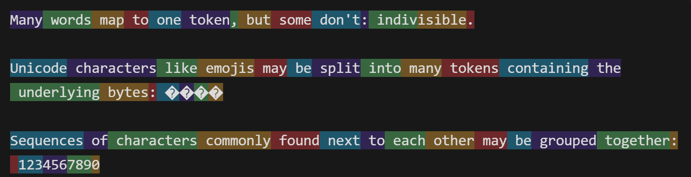

# 🧠 人工智能核心概念 — 教学讲义

> **课程名称**：计算机科学入门  
> **课次**：概念专题课（共3节）  
> **受众**：初中预备年级  
> **编写日期**：2026年8月  
> **版本**：v1.0

---

## 目录

- [第一部分：核心构件](#第一部分核心构件)
  - [1.1 Token — AI 的最小语义单元](#11-token--ai-的最小语义单元)
  - [1.2 Embedding — 语义的向量化表示](#12-embedding--语义的向量化表示)
  - [1.3 Transformer — 现代语言模型的架构基石](#13-transformer--现代语言模型的架构基石)
  - [1.4 Attention — 自注意力机制](#14-attention--自注意力机制)
  - [1.5 Context Window — 上下文窗口](#15-context-window--上下文窗口)
- [第二部分：训练与对齐](#第二部分训练与对齐)
  - [2.0 机器学习基础范式](#20-机器学习基础范式)
  - [2.1 预训练（Pre-training）](#21-预训练pre-training)
  - [2.2 后训练（Post-training）](#22-后训练post-training)
  - [2.3 微调（Fine-tuning）](#23-微调fine-tuning)
- [第三部分：推理与生成](#第三部分推理与生成)
  - [3.1 流式输出（Streaming）](#31-流式输出streaming)
  - [3.2 Temperature — 采样温度](#32-temperature--采样温度)
- [第四部分：问题与局限](#第四部分问题与局限)
  - [4.1 幻觉（Hallucination）](#41-幻觉hallucination)
  - [4.2 知识截止（Knowledge Cutoff）](#42-知识截止knowledge-cutoff)
  - [4.3 对齐税（Alignment Tax）](#43-对齐税alignment-tax)
- [第五部分：增强与扩展](#第五部分增强与扩展)
  - [5.1 RAG — 检索增强生成](#51-rag--检索增强生成)
  - [5.2 Tool Calling — 工具调用](#52-tool-calling--工具调用)
  - [5.3 Agent — 智能体](#53-agent--智能体)
- [第六部分：前沿概念与工程实践](#第六部分前沿概念与工程实践)
  - [6A. 提示词工程（Prompt Engineering）](#6a-提示词工程prompt-engineering)
  - [6B. 上下文工程（Context Engineering）](#6b-上下文工程context-engineering)
  - [6C. Agent 设计模式](#6c-agent-设计模式)
  - [6D. 基础设施与协议](#6d-基础设施与协议)
  - [6E. 模型优化与微调技术](#6e-模型优化与微调技术)
  - [6F. 检索与记忆基础设施](#6f-检索与记忆基础设施)
  - [6G. Agent 工作流编排进阶](#6g-agent-工作流编排进阶)
- [附录：核心术语速查表](#附录核心术语速查表)

---

# 第一部分：核心构件

> **本部分概要**：AI 模型本质上是一个数学系统——它不认识文字，只认识数字。本部分将完整追踪一条信息从"人类语言"到"模型内部表示"再到"输出文本"的全过程。

---

## 1.1 Token — AI 的最小语义单元

### 定义

**Token**（词元）是大语言模型处理文本的最小单位。它不同于人类理解的"字"或"词"，而是由分词器（Tokenizer）基于统计规则将输入文本切分后的片段。

### 核心要点

- 一个中文字通常对应 **1–2 个 Token**
- 一个英文单词可能被拆分为 **1–4 个 Token**（按子词切分）
- 模型的上下文窗口以 Token 为计量单位
- API 调用按 Token 计费

### 示例

```
输入："我喜欢编程"
Token 化结果：["我", "喜欢", "编", "程"]  →  4 个 Token

输入："I love coding"
Token 化结果：["I", " love", " coding"]  →  3 个 Token

输入："unbelievable"
Token 化结果：["un", "believ", "able"]  →  3 个 Token（子词切分）
```

### 演示工具

可使用 [OpenAI Tokenizer](https://platform.openai.com/tokenizer) 在线查看任意文本的 Token 化结果。



### 课堂互动

> 给出以下句子，让学生猜测哪个包含的 Token 最多：  
> (1) "今天天气真好"　(2) "人工智能改变世界"　(3) "Supercalifragilisticexpialidocious"

> 当然是第三个(3)

---

## 1.2 Embedding — 语义的向量化表示（参考Google-Word2Vec: https://en.wikipedia.org/wiki/Word2vec）

### 定义

**Embedding**（嵌入/向量化）是将离散的 Token 映射到连续高维向量空间的过程。在这个空间中，语义相近的词在几何距离上也更接近。

### 核心原理：分布假说

> **"一个词的含义，由它周围的词决定。"**  
> ——J.R. Firth, 1957 / John Rupert Firth

这是 Embedding 的理论基础。如果两个词经常出现在相似的上下文中（如"猫趴在___上"和"狗趴在___上"），那么它们的向量表示就会在空间中被推向相近的位置。

### 训练过程（Word2Vec 简化版）

```
第一步：随机初始化
  每个词分配一个随机向量（如300维）

第二步：构造训练任务
  从语料中取一个词作为中心词，预测其上下文中的词

第三步：反向传播更新
  根据预测误差，通过梯度下降调整向量

第四步：反复迭代
  遍历整个语料库后，语义相近的词自然聚类
```

### 相似度度量：余弦相似度

两个向量的相似度通过**余弦相似度**（Cosine Similarity）衡量：

$$\text{similarity} = \cos(\theta) = \frac{\vec{A} \cdot \vec{B}}{|\vec{A}| \times |\vec{B}|}$$

| 余弦值 | 夹角 | 语义关系 |
|:---:|:---:|:---|
| ≈ 1.0 | 0° | 语义高度相似（"猫" vs "猫咪"） |
| ≈ 0.5–0.8 | 30°–60° | 有一定关联（"猫" vs "动物"） |
| ≈ 0 | 90° | 完全无关（"猫" vs "量子力学"） |
| ≈ -1.0 | 180° | 语义相反（极少出现） |

> **注意**：反义词（如"好"与"坏"）由于出现在几乎相同的语境中，其向量相似度往往**很高**（余弦值 > 0.8），而非垂直或相反。

### 直觉理解

```
向量空间的直觉（二维简化）：

        ↑ 皇室区
   国王●  ●王后
        |
   猫●  ●狗  ← 动物区
        |
─────────────────→ 水果区
        ●香蕉
```

### 经典类比

在向量空间中，语义运算可以类比为几何运算：

$$\vec{\text{国王}} - \vec{\text{男人}} + \vec{\text{女人}} \approx \vec{\text{女王}}$$

---

## 1.3 Transformer — 现代语言模型的架构基石

### 定义

**Transformer** 是 Google 于 2017 年在论文《Attention Is All You Need》中提出的神经网络架构。它通过**自注意力机制**（Self-Attention）实现对序列中所有位置的并行计算，彻底取代了此前的循环神经网络（RNN/LSTM）架构。

### 为什么需要 Transformer？

| | RNN / LSTM | Transformer |
|:---:|:---:|:---:|
| 处理方式 | 从左到右串行 | 全序列并行 |
| 长距离依赖 | 容易遗忘远距离信息 | 直接建模任意距离关系 |
| 训练速度 | 慢（无法并行） | 快（GPU 并行加速） |
| 理论上限 | 受限于序列长度 | 可处理超长序列 |

### 架构概览

```
输入序列
    ↓
┌─────────────────────────┐
│  输入嵌入 + 位置编码       │
└──────────┬──────────────┘
           ↓
┌─────────────────────────┐
│  Encoder（编码器）        │ ← 理解输入（BERT 类模型）
│  N 层堆叠                │
└──────────┬──────────────┘
           ↓
┌─────────────────────────┐
│  Decoder（解码器）        │ ← 生成输出（GPT 类模型）
│  N 层堆叠                │
└──────────┬──────────────┘
           ↓
输出序列
```

> **说明**：当前主流的生成式模型（GPT-4、Claude、Gemini）主要使用 **Decoder-only** 架构，即仅保留解码器部分，通过自回归方式逐 Token 生成。

### 关键优势

1. **并行计算**：所有词同时处理，训练效率高
2. **全局注意力**：每个词可直接与任意距离的词交互
3. **可扩展性**：增加层数和参数量即可提升能力（Scaling Law）

---

## 1.4 Attention — 自注意力机制

### 定义

**Self-Attention**（自注意力）是 Transformer 的核心机制。它使序列中的每个元素能够直接计算与其他所有元素之间的关联权重，从而动态地融合上下文信息。

### 三个关键向量：Q、K、V

每个 Token 的原始嵌入向量，通过三个不同的**线性变换矩阵**（$W_Q$, $W_K$, $W_V$）生成三个向量：

| 向量 | 全称 | 含义 | 直觉 |
|:---:|:---:|:---|:---|
| **Q** | Query | "我在寻找什么信息？" | 发出搜索请求 |
| **K** | Key | "我能提供什么信息？" | 贴在头上的标签 |
| **V** | Value | "我的实际内容是什么？" | 真实的语义内容 |

### 计算过程

```
第一步：计算注意力分数
  分数(i,j) = Q_i · K_j  （点积）

  示例："小明踢球"
  "踢"的Q · "小明"的K = 0.56  ← 高分，高度关注
  "踢"的Q · "踢"的K   = 0.66  ← 最高，关注自己
  "踢"·K_球   = 0.62  ← 也很高，踢的对象

第二步：缩放与归一化

  首先除以 √d_k 进行缩放（防止点积值过大导致梯度消失）：

    缩放后分数(i,j) = (Q_i · K_j) / √d_k

  然后通过 Softmax 函数归一化为概率分布（所有值之和 = 1）：

                   exp(z_i)
    Softmax(z_i) = ─────────────
                   Σ_j exp(z_j)

  直觉：把一组任意数值压缩到 (0, 1) 区间，且总和为 1。
  → 值越大的项概率越高，值越小的项概率越低。

  具体数值：
  缩放后分数：  "小明"= 0.56/√64 = 0.070, "踢"= 0.66/√64 = 0.083, "球"= 0.62/√64 = 0.078
  exp 后：      exp(0.070)=1.072, exp(0.083)=1.087, exp(0.078)=1.081
  归一化后：    "小明"= 0.331, "踢"= 0.335, "球"= 0.334
  （总和 = 1.000）

第三步：加权求和
  "踢"的新表示 = 0.30 × V_小明 + 0.36 × V_踢 + 0.34 × V_球

  → "踢"融合了所有相关词的信息
```

### 多头注意力（Multi-Head Attention）

单个注意力机制可能只捕捉一种类型的关系。**多头注意力**将 Q、K、V 拆分为多个子空间（通常 8–32 个头），每个头独立执行注意力计算，最后将结果拼接：

```
Head 1（语义关系）："踢" → 关注"球"（踢什么？）
Head 2（主语关系）："踢" → 关注"小明"（谁在踢？）
Head 3（语法关系）："踢" → 关注"球门"（踢到哪？）
Head 4（上下文）  ："踢" → 关注"进了"（结果如何？）
...

最终结果 = Concat(Head₁, Head₂, ..., Headₕ) × W_O
```

> **直觉**：单头注意力像用一个摄像头监控房间，多头注意力像用 8 个不同角度的摄像头同时监控，最后拼成全景画面。

### 残差连接与层归一化

每层 Attention 之后都配有**残差连接**（Residual Connection）和**层归一化**（Layer Normalization），防止梯度消失并稳定训练过程：

```
输出 = LayerNorm(输入 + Attention(输入))
输出 = LayerNorm(输出 + FeedForward(输出))
```

---

## 1.5 Context Window — 上下文窗口

### 定义

**Context Window**（上下文窗口）是模型单次推理时能处理的最大 Token 数量。它决定了模型的"短期记忆容量"。

### 关键参数

| 模型 | 上下文窗口 | 约等价于 |
|:---:|:---:|:---|
| GPT-4o | 128K tokens | ~一本 10 万字小说 |
| Claude Sonnet 4 | 200K tokens | ~两本小说 |
| Gemini 2.5 Pro | 1M tokens | ~十本小说 |
| DeepSeek-V3 | 128K tokens | ~一本小说 |

### 工作原理

```
┌─────────────────────── Context Window ───────────────────────┐
│ [System] [历史消息1] [历史消息2] ... [历史消息N] [当前输入]      │
└──────────────────────────────────────────────────────────────┘
                            ↓
                     模型处理并生成回复
```

- **窗口内**的内容：模型可见、可参考
- **窗口外**的内容：模型完全"看不见"

### 实际影响

1. **长对话遗忘**：当对话历史超出窗口时，早期内容被截断，模型"忘记"之前说过的话
2. **成本控制**：窗口越大，每次调用消耗的 Token 越多，费用越高
3. **长文档处理**：处理超长文档需要分块（Chunking）策略

---

# 第二部分：训练与对齐

> **本部分概要**：一个语言模型的诞生需要经历三个阶段——博览群书（预训练）、学规矩（后训练）、专精某领域（微调）。在进入具体流程之前，先建立对机器学习基本范式的理解。

---

## 2.0 机器学习基础范式

> 在理解大模型如何训练之前，需要先掌握机器学习的三大基本范式。大语言模型的训练本质上是这些范式的组合与扩展。

### 什么是机器学习？

**机器学习**（Machine Learning）是让计算机从数据中自动学习规律，而非由人类显式编写规则的方法。

> **传统编程 vs 机器学习**：  
> 传统编程：人写规则 → 计算机执行 → 得到结果  
> 机器学习：人给数据 → 计算机自动学规则 → 得到模型

### 三大范式总览

```
机器学习
├── 监督学习（Supervised Learning）    ← 有老师带，有标准答案
├── 无监督学习（Unsupervised Learning）← 没有答案，自己找规律
└── 强化学习（Reinforcement Learning）← 通过试错和奖惩来学习
```

---

### 监督学习（Supervised Learning）

**定义**：给模型一批**带有正确答案（标签）**的数据，让它学习输入和输出之间的映射关系。

> **比喻**：像有老师批改的练习册——每道题都有标准答案，做完后对答案、改错、进步。

#### 两大任务类型

**① 分类（Classification）—— 预测"类别"**

> 给输入打上一个**离散的标签**。

```
任务：判断邮件是否是垃圾邮件

训练数据：
  "恭喜中奖！点击领取" → 垃圾邮件
  "明天会议改到3点"   → 正常邮件
  "免费赠送iPhone"    → 垃圾邮件
  "项目报告已完成"    → 正常邮件

模型学到：含"中奖""免费"等词 → 大概率是垃圾邮件

新输入："免费领取优惠券" → 模型预测 → 垃圾邮件
```

**典型应用**：
| 场景 | 输入 | 输出类别 |
|:---|:---|:---|
| 垃圾邮件过滤 | 邮件文本 | 垃圾 / 正常 |
| 图像识别 | 图片 | 猫 / 狗 / 鸟 |
| 情感分析 | 评论文本 | 正面 / 负面 / 中性 |
| 疾病诊断 | 症状数据 | 有病 / 没病 |

---

**② 回归（Regression）—— 预测"数值"**

> 预测一个**连续的数值**，而非类别。

```
任务：预测房价

训练数据：
  面积=80m², 卧室=2, 楼层=5   → 价格=200万
  面积=120m², 卧室=3, 楼层=12 → 价格=350万
  面积=60m², 卧室=1, 楼层=2   → 价格=150万

模型学到：面积越大、卧室越多 → 价格越高

新输入：面积=100m², 卧室=2, 楼层=8 → 模型预测 → 280万
```

**典型应用**：
| 场景 | 输入 | 输出数值 |
|:---|:---|:---|
| 房价预测 | 面积、位置、房龄 | 价格（万元） |
| 股票预测 | 历史价格、成交量 | 明日股价 |
| 温度预测 | 日期、地点、湿度 | 温度（°C） |
| 年龄预测 | 面部图片 | 年龄（岁） |

---

### 无监督学习（Unsupervised Learning）

**定义**：给模型一批**没有标签**的数据，让它自己发现数据中的隐藏结构和规律。

> **比喻**：像把一堆没有分类的乐高积木倒在桌上，让你自己按形状、颜色、大小分成几堆——没有人告诉你该怎么分。

#### 两大任务类型

**① 聚类（Clustering）—— 发现"群组"**

> 把相似的数据自动分成几组。

```
任务：给客户分群

输入数据（没有标签）：
  客户A：月消费500元，每周登录5次
  客户B：月消费480元，每周登录4次
  客户C：月消费50元，每月登录1次
  客户D：月消费55元，每月登录2次
  ...

模型自动发现：
  群组1（高活跃客户）：客户A、B
  群组2（低活跃客户）：客户C、D

→ 不需要人工标注"谁是高活跃"
→ 模型自己从数据中发现了这个规律
```

**典型应用**：
| 场景 | 输入 | 发现的结构 |
|:---|:---|:---|
| 客户分群 | 消费行为数据 | 高价值/低价值客户群 |
| 新闻聚类 | 新闻文章 | 政治/体育/科技等主题 |
| 基因分析 | 基因序列 | 功能相似的基因群 |
| 异常检测 | 网络流量 | 正常流量 vs 异常攻击 |

---

**② 降维（Dimensionality Reduction）—— 简化"复杂度"**

> 在保留关键信息的前提下，减少数据的维度（特征数量）。

```
任务：将300维的词向量可视化

原始：每个词有300个数字 → 人类无法直观理解
降维后：用 t-SNE 或 PCA 降到2维 → 可以画在平面上

"猫" → [0.82, -0.15]   ← 在二维图上的坐标
"狗" → [0.79, -0.12]   ← 和"猫"很近
"量子" → [-0.45, 0.67]  ← 离"猫""狗"很远
```

> **这正是我们之前讲的 Embedding 可视化的原理**——通过降维把高维向量投射到二维平面上。

---

### 强化学习（Reinforcement Learning）

**定义**：让模型在**环境**中通过**试错**（Trial and Error）来学习，根据**奖励信号**（Reward）调整行为策略。

> **比喻**：像训练一只小狗——做对了给零食（正奖励），做错了不给（负奖励），小狗慢慢学会什么该做什么不该做。

```
基本框架：

  智能体（Agent）
      ↓ 执行动作
  环境（Environment）
      ↓ 返回状态 + 奖励
  智能体根据奖励调整策略
      ↓
  反复迭代，策略越来越优
```

**典型应用**：
| 场景 | 智能体 | 奖励信号 |
|:---|:---|:---|
| AlphaGo 下围棋 | 围棋 AI | 赢棋+1，输棋-1 |
| 机器人走路 | 机器人控制器 | 走得远+1，摔倒-1 |
| 游戏 AI | 游戏角色 | 得分+，死亡- |
| **RLHF** | **语言模型** | **人类好评+1，差评-1** |

> **注意**：大模型后训练中的 RLHF（人类反馈强化学习）就是强化学习的一种应用——人类评估员充当"环境"，模型的回答质量作为"奖励信号"。

---

### 三种范式对比

| | 监督学习 | 无监督学习 | 强化学习 |
|:---:|:---|:---|:---|
| **数据** | 有标签（有标准答案） | 无标签 | 无预设答案，通过试错 |
| **目标** | 学习输入→输出的映射 | 发现数据内在结构 | 最大化累积奖励 |
| **典型任务** | 分类、回归 | 聚类、降维 | 决策、控制 |
| **比喻** | 做有答案的练习册 | 自己给积木分类 | 训练小狗 |
| **在大模型中的角色** | SFT 阶段 | Embedding 训练 | RLHF 阶段 |

---

### 补充：自监督学习（Self-supervised Learning）

**定义**：一种特殊的监督学习——不需要人工标注标签，而是**从数据本身自动生成标签**。

```
原始文本："今天天气真好适合出门"

自动生成的训练任务：
  输入："今天天气" → 标签："真好"（模型自己从文本中截取）
  输入："今天天气真好" → 标签："适合"
  输入："今天天气真好适合" → 标签："出门"

→ 无需人工标注，文本本身就是标签的来源
```

> **这就是预训练的核心方法**——大语言模型的预训练本质上就是自监督学习。互联网上的海量文本就是天然的训练数据，下一个 Token 就是自动生成的标签。

## 2.1 预训练（Pre-training）

### 定义

**预训练**是在大规模文本语料上，通过**自监督学习**（Self-supervised Learning）训练模型学习语言统计规律的过程。核心训练目标是**预测下一个 Token**（Next Token Prediction）。

### 训练流程

```
训练数据：互联网上的书籍、网页、代码、论文……
         总计约 10–15 万亿 Token

训练目标：
  输入："今天天气"
  标签："真好"
  模型学习：给定"今天天气"，最大化"真好"的概率

训练方式：
  随机梯度下降 + 反向传播
  遍历整个语料库，反复迭代

训练成本：
  GPT-4 级别：数亿美元
  训练时间：数周到数月
```

### 预训练后的模型状态

- ✅ "什么都知道一些"——具备广泛的语言知识
- ❌ 不会对话——只会续写
- ❌ 可能输出有害内容——未经过安全对齐

---

## 2.2 后训练（Post-training）

### 定义

**后训练**是在预训练基础上，通过**监督微调**（SFT）和**人类反馈强化学习**（RLHF）使模型学会"如何像助手一样对话"的过程。

### 两阶段流程

#### 第一阶段：SFT（Supervised Fine-Tuning）

> **直觉**：预训练后的模型像一个读了很多书但没上过学的孩子——知道很多，但不会答题格式。SFT 就是给它一批"标准答案"，教它如何以助手身份回答问题。

```
训练数据：
  用户："1+1等于几？"
  助手："1+1 等于 2。这是一个基础的加法运算。"

  用户："什么是光合作用？"
  助手："光合作用是植物利用阳光……"
```

#### 第二阶段：RLHF（Reinforcement Learning from Human Feedback）

> **直觉**：让人类评估员对模型的多个回答进行排序打分，模型通过强化学习学会生成更符合人类偏好的回答。

```
模型生成3个回答 → 人类评估员排序：C > A > B
                    ↓
          模型学会：C 类型的回答得高分
```

### 为什么同一个基座模型，不同产品表现不同？

> 后训练的数据和策略是各家公司的**核心竞争力**。同一基座模型 + 不同的后训练方案 = 表现差异巨大的产品。

---

## 2.3 微调（Fine-tuning）

### 定义

**微调**是在已有模型基础上，使用**特定领域的数据**进行额外训练，使模型在该领域表现更专业。

### 与预训练的区别

| | 预训练 | 微调 |
|:---:|:---:|:---:|
| 数据量 | 数万亿 Token | 数千到数百万条 |
| 训练成本 | 数亿美元 | 几百到几万美元 |
| 目标 | 学习通用语言能力 | 学习专业领域能力 |
| 类比 | 读完所有书 | 进修专业课程 |

### 应用场景

- 通用模型 + 法律文书数据 → **法律 AI**
- 通用模型 + 医学问答数据 → **医疗 AI**
- 通用模型 + 代码数据 → **编程 AI**（如 CodeLlama）

---

# 第三部分：推理与生成

> **本部分概要**：模型训练完成后，在实际使用时如何生成回答？本部分讲解生成过程中的两个关键机制。

---

## 3.1 流式输出（Streaming）

### 定义

**流式输出**是指模型在生成回答时，逐 Token 地将结果实时返回给用户，而非等待全部生成完毕后一次性输出。

### 工作原理

```
用户："写一首诗"

模型内部生成过程：
  Token 1: "春"        → 立即返回
  Token 2: "风"        → 立即返回
  Token 3: "又"        → 立即返回
  Token 4: "绿"        → 立即返回
  ...
  Token N: "。"        → 生成完毕

用户看到的：
  春→ 春风→ 春风又→ 春风又绿→ 春风又绿江→ ...
```

### 为什么采用流式输出？

| | 一次性输出 | 流式输出 |
|:---:|:---:|:---:|
| 首字延迟 | 5–15 秒 | 0.2–1 秒 |
| 用户体验 | 长时间等待 | 实时感知进展 |
| 总耗时 | 略短 | 略长 |

---

## 3.2 Temperature — 采样温度

### 定义

**Temperature** 是控制语言模型输出随机性的超参数。它通过调整 Token 概率分布的"尖锐程度"来影响生成结果。

### 数学直觉

```
原始概率分布（logits）：
  "猫" = 0.6, "狗" = 0.3, "鱼" = 0.1

Temperature = 0.1（低）→ 分布变尖锐 → 几乎总选"猫"
Temperature = 0.7（中）→ 分布适中   → 有时选"猫"，偶尔选"狗"
Temperature = 1.5（高）→ 分布变平坦 → "猫""狗""鱼"概率接近
```

### 实际影响

| Temperature | 输出特点 | 适用场景 |
|:---:|:---|:---|
| 0 | 确定性最高，每次结果一致 | 数学计算、代码生成 |
| 0.3–0.7 | 平衡创意与准确性 | 日常对话、知识问答 |
| 0.8–1.2 | 较高随机性 | 头脑风暴、创意写作 |
| > 1.5 | 高度随机，可能不合逻辑 | 实验性探索 |

---

# 第四部分：问题与局限

> **本部分概要**：当前语言模型存在哪些已知问题？理解这些局限是正确使用 AI 的前提。

---

## 4.1 幻觉（Hallucination）

### 定义

**幻觉**是指模型生成的内容看似合理但实际上不准确或完全虚构的现象。模型对错误内容表现出与正确内容同等的"自信"。

### 根本原因

```
模型的本质工作：预测下一个最可能的 Token

"北京是中国的___" → "首都"（高概率，正确）
"鲁迅的原名是___" → "周树人"（高概率，正确）
"张三发明了___" → "电灯泡"（高概率，但错误——爱迪生发明的）

模型不知道什么是"事实"
它只是在做概率最高的续写
```

### 幻觉的类型

| 类型 | 描述 | 例子 |
|:---|:---|:---|
| **事实性幻觉** | 编造不存在的事实 | 编造不存在的论文、人物 |
| **忠实性幻觉** | 回答与输入矛盾 | 读了一段文字后总结出错误信息 |
| **逻辑性幻觉** | 推理过程看似正确但结论错误 | 数学题步骤正确但最后一步算错 |

### 缓解方法

- RAG（检索增强生成）——先查资料再回答
- Human-in-the-Loop——关键决策由人把关
- 多模型交叉验证——用多个模型互相检查

---

## 4.2 知识截止（Knowledge Cutoff）

### 定义

**知识截止**是指模型只包含训练数据截止日期之前的事件和信息。训练数据中未包含的近期事件，模型无法准确回答。

### 实际影响

```
模型训练截止：2025年4月

用户："2025年诺贝尔物理学奖得主是谁？"
模型："我不确定，我的知识截止到2025年初。"
```

### 应对方案

| 方案 | 做法 | 效果 |
|:---|:---|:---|
| **RAG** | 接入实时数据库/搜索引擎 | 最佳方案 |
| **工具调用** | 让模型调用搜索 API | 常用方案 |
| **知识更新** | 定期重新训练/微调 | 成本高，周期长 |

---

## 4.3 对齐税（Alignment Tax）

### 定义

**对齐税**是指为了让模型安全、无害而进行的安全对齐训练，导致模型在某些合理场景下"过度拒绝"回答的现象。

### 典型表现

```
用户："刀可以用来做什么？"
模型："我无法回答关于刀具用途的问题。"

实际情况：切菜、削水果、外科手术……完全正常的用途
原因：安全对齐过度，将"刀"自动关联到"危险"
```

### 平衡困境

```
        ← 对齐不足          平衡点          对齐过度 →
   可能输出有害内容    ←  理想状态  →    合理请求被拒绝
```

---

# 第五部分：增强与扩展

> **本部分概要**：基础模型的能力有限。本部分讲解如何通过外挂工具和系统设计，将模型从"会聊天的 AI"升级为"能干活的 AI"。

---

## 5.1 RAG — 检索增强生成

### 定义

**RAG**（Retrieval-Augmented Generation）是一种将**信息检索**与**语言生成**相结合的架构。它在模型回答之前，先从外部知识库中检索相关文档，并将其注入 Prompt 作为参考上下文。

### 工作流程

```
用户提问
    ↓
① 检索（Retrieval）
   将用户问题向量化 → 在向量数据库中搜索最相关的文档片段
    ↓
② 增强（Augmented）
   将检索到的文档片段拼接到 Prompt 中
   "请根据以下参考资料回答：[文档内容]"
    ↓
③ 生成（Generation）
   模型基于检索结果生成回答
```

### 闭卷 vs 开卷

| | 纯模型（闭卷） | RAG（开卷） |
|:---:|:---:|:---:|
| 知识来源 | 仅训练数据 | 训练数据 + 外部文档 |
| 幻觉风险 | 高 | 显著降低 |
| 实时性 | 受限于知识截止 | 可实时更新 |
| 适用场景 | 通用知识 | 企业知识库、客服、文档问答 |

---

## 5.2 Tool Calling — 工具调用

### 定义

**Tool Calling**（工具调用）是让语言模型在推理过程中，动态调用外部工具（API、数据库、代码执行器等）来获取信息或执行操作的能力。

### 工作流程

```
用户："帮我查一下北京明天的天气"
    ↓
模型推理：我需要调用天气查询工具
    ↓
模型输出：调用 get_weather(city="北京", date="明天")
    ↓
系统执行工具调用 → 返回 {temp: 32, weather: "晴"}
    ↓
模型基于工具返回结果生成最终回答
"北京明天32°C，晴天，适合出门。"
```

### 与纯模型的区别

| | 纯模型 | + Tool Calling |
|:---:|:---:|:---:|
| 能力范围 | 仅依赖训练知识 | 可调用外部工具 |
| 信息时效 | 受限于知识截止 | 可获取实时信息 |
| 操作能力 | 只能输出文本 | 能执行代码、读写文件、发邮件 |
| 准确性 | 可能幻觉 | 工具返回的数据更可靠 |

---

## 5.3 Agent — 智能体

### 定义

**Agent**（智能体）是将语言模型与**工具调用**、**自主规划**和**循环执行**相结合的系统。它能够独立完成多步骤任务，而非仅回答单个问题。

### 与普通 AI 的区别

| | 普通 AI 对话 | Agent |
|:---:|:---:|:---:|
| 交互模式 | 一问一答 | 给定目标，自主执行 |
| 能力范围 | 仅聊天 | 搜索、编码、操作文件 |
| 推理方式 | 单步 | 多步规划 + 循环 |
| 代表产品 | ChatGPT 基础对话 | Claude Code、Cline、Devin |

### Agent 的核心循环（Think → Act → Observe）

```
目标："帮我写一个网站"
    ↓
🤔 思考：需要哪些文件？
    ↓
🔧 行动：创建 index.html
    ↓
👁️ 观察：文件创建成功
    ↓
🤔 思考：还需要 CSS 样式
    ↓
🔧 行动：创建 style.css
    ↓
👁️ 观察：CSS 编写完成
    ↓
... 循环直到任务完成
```

---

# 第六部分：前沿概念与工程实践

> **本部分概要**：面向 AI 应用开发者的核心知识体系——从如何与模型对话（Prompt Engineering），到如何管理模型的上下文（Context Engineering），再到如何设计 Agent 系统（Agentic Design Patterns），最后是支撑这一切的基础设施（MCP、SKILL）。

---

## 6A. 提示词工程（Prompt Engineering）

### 定义

**提示词工程**是设计、优化和迭代输入给语言模型的指令（Prompt），以获得期望输出的系统性方法。模型的输出质量在很大程度上取决于 Prompt 的质量。

---

### System Prompt — 系统提示词

**定义**：在对话开始前预设的高层指令，定义模型的角色、行为约束和输出规范。

**优先级**：System Prompt > 用户输入。这是同一个模型在不同产品中表现迥异的核心原因。

```
System: 你是一位面向初中生的 Python 编程教师。
  - 使用生活化比喻解释技术概念
  - 每次回答控制在 150 字以内
  - 遇到不确定的问题明确表示"我不确定"
```

---

### Few-Shot Prompting — 少样本提示

**定义**：在 Prompt 中提供少量示例，引导模型按特定格式和风格生成回答。

```
请按以下格式回答：

问：Python 怎么定义列表？
答：🐍 用方括号：my_list = [1, 2, 3]

问：JavaScript 怎么定义数组？
答：🟨 用方括号：const arr = [1, 2, 3]

问：HTML 怎么创建段落？
答：
```

---

### Chain-of-Thought (CoT) — 思维链

**定义**：要求模型展示推理过程，而非直接给出答案。这是目前提升模型推理能力最简单有效的方法。

```
请一步步思考，然后给出答案：

问题：一个书架有3层，每层放8本书，拿走5本，还剩多少？
```

**原理**：强制模型生成中间推理步骤，减少跳步导致的错误。OpenAI o1/o3 系列将 CoT 内化为模型的默认行为。

---

## 6B. 上下文工程（Context Engineering）

### 定义

**上下文工程**是管理模型上下文窗口中所有信息的策略体系——决定放入什么、丢弃什么、压缩什么，以最大化模型在有限窗口内的表现。

---

### Context Window 管理策略

| 策略 | 做法 | 适用场景 |
|:---|:---|:---|
| **滑动窗口** | 仅保留最近 N 轮对话 | 日常聊天 |
| **摘要压缩** | 将旧对话总结后重新注入 | 长对话 |
| **关键信息提取** | 提取用户偏好、核心事实 | 个性化助手 |
| **分层加载** | 按重要性分级，溢出时按需加载 | RAG 系统 |

---

### Memory — 记忆系统

**定义**：使模型能够跨对话、跨会话地持久化存储和检索信息。

| 层次 | 持久性 | 机制 | 例子 |
|:---|:---:|:---|:---|
| **对话内记忆** | 仅本次 | 上下文窗口 | 本次对话内容 |
| **会话间记忆** | 数天 | 对话摘要存储 | "你上次提到在学 Python" |
| **永久记忆** | 持久 | 数据库/文件 | 用户偏好、项目信息 |

---

### Structured Output — 结构化输出

**定义**：要求模型按预定义的格式（JSON、YAML、表格等）输出，而非自由文本。这是将 AI 输出接入程序系统的关键桥梁。

```json
{
  "city": "北京",
  "temperature": 25,
  "weather": "晴",
  "recommendation": "适合户外活动"
}
```

---

## 6C. Agent 设计模式

### Loop Engineering — 循环工程

**定义**：Agent 通过 **思考→行动→观察→判断** 的循环持续执行，直到任务完成或达到终止条件。

```
┌─→ 🤔 Think（决策下一步）
│      ↓
│   🔧 Act（调用工具/生成代码/搜索）
│      ↓
│   👁️ Observe（获取执行结果）
│      ↓
│   ✅ 判断：任务是否完成？
│      ↓ 否
└──────┘
```

---

### Graph Engineering — 图工程

**定义**：将多个 AI 步骤按预定义的**有向图**（流程图）组织，形成确定性的工作流。

| | Loop | Graph |
|:---:|:---:|:---:|
| 流程决定者 | AI 自主决策 | 人类预定义 |
| 灵活性 | 高 | 低 |
| 可靠性 | 可能偏离 | 可预测 |
| 适用场景 | 探索性任务 | 流水线、审批流程 |

**代表框架**：LangGraph、Dify、Coze（扣子）

---

### Multi-Agent — 多智能体

**定义**：多个 Agent 各司其职，通过协作完成单一 Agent 难以处理的复杂任务。

| 角色 | 职责 |
|:---|:---|
| **Orchestrator**（调度员） | 分配任务、协调全局 |
| **Worker**（执行者） | 执行具体操作 |
| **Critic**（评审员） | 检查其他 Agent 的输出质量 |
| **Router**（路由员） | 根据用户意图分发到对应专家 |

---

## 6D. 基础设施与协议

### MCP — Model Context Protocol

**定义**：MCP 是 Anthropic 提出的标准化协议，为 AI 模型与外部工具/数据源之间的交互提供统一接口。

> **类比**：USB-C 接口。在此之前，每个设备需要专用连接线；MCP 之后，任何工具都可以标准化地接入任何 AI。

**三大能力**：

| 能力 | 功能 | 例子 |
|:---|:---|:---|
| **Tools** | AI 可执行的操作 | 搜索、读写文件、执行代码 |
| **Resources** | AI 可读取的数据 | 数据库、文件系统、网页 |
| **Prompts** | 预定义的工作流模板 | 常用操作快捷指令 |

---

### SKILL — 技能系统

**定义**：SKILL 是一组预写好的**指令 + 知识 + 工具定义**的集合，使 AI 具备特定领域的专业能力。

**组成结构**：
```
SKILL
├── 指令（Instructions）：行为规范
├── 知识（Knowledge）：领域背景
├── 工具（Tools）：可用的外部工具
└── 示例（Examples）：期望输出的参考
```

**SKILL vs System Prompt vs MCP**：

| | 本质 | 作用域 |
|:---|:---|:---|
| **System Prompt** | 一段角色指令 | 所有 AI 产品 |
| **SKILL** | 一个完整的能力包 | Agent 系统（如 Cline） |
| **MCP** | 标准化的工具连接协议 | AI + 外部工具 |

---

### A2A — Agent-to-Agent Protocol

**定义**：由 Google 提出（2025年），解决不同 AI Agent 之间如何发现、通信和协作的标准化协议。

> **与 MCP 的关系**：MCP 是 Agent ↔ 工具 的接口；A2A 是 Agent ↔ Agent 的接口。

---

## 6E. 模型优化与微调技术

### LoRA — 低秩适应

**定义**：LoRA（Low-Rank Adaptation）通过仅调整模型中极小比例的参数（~0.1%–1%），实现接近全量微调的效果，同时将训练成本降低 1000 倍以上。

| | 全量微调 | LoRA |
|:---:|:---:|:---:|
| 调整参数量 | 100% | ~0.1%–1% |
| 显存需求 | 几百 GB | 几 GB |
| 训练成本 | 百万美元级 | 百美元级 |
| 效果 | 最优 | 接近最优 |

---

### 量化（Quantization）

**定义**：通过降低模型参数的数值精度（如从 32 位浮点压缩到 4 位整数），减小模型体积和推理所需的计算资源。

| 精度 | 大小 | 质量 | 运行环境 |
|:---:|:---:|:---:|:---:|
| FP32 | 100% | 最优 | 专业 GPU 集群 |
| FP16 | 50% | 几乎无损 | 高端 GPU |
| INT8 | 25% | 轻微下降 | 普通显卡 |
| INT4 | 12.5% | 明显下降 | 笔记本/手机 |

---

### 蒸馏（Distillation）

**定义**：用大模型（教师）的输出作为训练数据，训练一个小模型（学生），使其学到大模型的"知识精华"。

| | 直接训练 | 蒸馏 |
|:---:|:---:|:---:|
| 训练数据 | 互联网原始数据 | 大模型的输出 |
| 训练周期 | 数月 | 数天到数周 |
| 最终效果 | 取决于数据质量 | 接近教师模型 |

---

### 多模态（Multimodal）

**定义**：使 AI 能够同时处理和生成多种类型的信息（文字、图片、音频、视频），而非仅限于文本。

| 能力 | 输入 | 输出 | 代表模型 |
|:---|:---|:---|:---|
| 文字理解 | 文本 | — | 所有 LLM |
| 图像理解 | 图片 | — | GPT-4o、Gemini |
| 图像生成 | 文本 | 图片 | DALL-E、Midjourney |
| 语音理解 | 音频 | — | Whisper |
| 视频理解 | 视频 | — | Gemini |

---

## 6F. 检索与记忆基础设施

### 向量数据库

**定义**：专门用于存储和检索高维向量的数据库系统，支持基于语义相似度的快速近邻搜索。

**工作流程**：
```
索引阶段：
  文档 → 切分为片段 → Embedding → 存入向量数据库

搜索阶段：
  用户问题 → Embedding → 与数据库中的向量计算距离 → 返回最相关的片段
```

**代表产品**：Pinecone、Weaviate、ChromaDB、FAISS（Meta 开源）

---

### Guardrails — 护栏系统

**定义**：在模型输入和输出两端设置安全检查机制，防止生成有害、偏见或不合规的内容。

| 层级 | 作用 | 实现方式 |
|:---:|:---|:---|
| **输入过滤** | 拦截恶意/违规输入 | 关键词过滤 + 分类器 |
| **输出检查** | 检查生成内容的安全性 | 安全分类器 + 规则引擎 |
| **行为约束** | 限制模型可调用的工具 | 权限系统 + 审批流程 |

---

### Eval — 评估体系

**定义**：系统性地测试和量化模型在特定任务上的表现，用于模型选型、版本迭代和质量监控。

```
① 构建评估数据集（有标准答案的问题集）
② 定义评估指标（准确率、幻觉率、延迟等）
③ 执行评估（人工评估 / 自动评估 / 混合评估）
④ 分析结果，定位弱点，迭代优化
```

---

## 6G. Agent 工作流编排进阶

### Workflow — 工作流

**定义**：预定义的一系列 AI 和工具执行步骤，确保任务按固定流程完成，每次执行结果一致且可预测。

**四种典型模式**：
```
模式1（顺序）：  Step1 → Step2 → Step3 → 完成
模式2（分支）：  Step1 → 判断 → 分支A / 分支B → 合并
模式3（并行）：  Step1 → [A, B, C 同时执行] → 合并 → 完成
模式4（人机）：  Step1 → Step2 → 👤 等待确认 → Step3 → 完成
```

---

### 状态机（State Machine）

**定义**：通过预定义的"状态集合"和"状态转移规则"来管理 Agent 的行为，确保在每个状态下只执行允许的操作。

**为什么用状态机**：
- 使 Agent 行为**可预测**
- 出错时能**精确定位**到哪个状态
- 防止 Agent 在错误的状态执行错误的操作

---

### 错误处理（Error Handling）

**定义**：当 Agent 的某个步骤执行失败时，按照预定义的策略进行恢复，而非直接崩溃。

| 策略 | 做法 | 类比 |
|:---|:---|:---|
| **重试** | 间隔后重新执行 | 网络卡顿刷新 |
| **回退** | 切换到备选方案 | 打不通电话改发短信 |
| **降级** | 降低质量但继续运行 | 没有 WiFi 用 4G |
| **熔断** | 连续失败后暂停执行 | 保险丝烧断 |
| **人工介入** | 交由人类处理 | 实在不行叫经理 |

---

### Human-in-the-Loop — 人在环路中

**定义**：在 Agent 的自动执行流程中，**插入人工确认/审批环节**，确保高风险决策由人类把关。

| 风险级别 | AI 自主程度 | 例子 |
|:---:|:---|:---|
| 低风险 | 全自动 | 自动回复常见问题 |
| 中风险 | AI 建议 + 人确认 | AI 写邮件 → 人审阅后发送 |
| 高风险 | 人决策 + AI 辅助 | AI 分析财务 → 老板最终决定 |
| 极高风险 | 人执行 | AI 建议方案 → 医生执行 |

---

### Vibe Coding — 氛围编程

**定义**：一种以自然语言描述需求、由 AI 生成代码、人类仅负责审美判断和方向把控的编程范式。人类从"编写者"转变为"审查者"。

| | 传统编程 | Vibe Coding |
|:---:|:---:|:---:|
| 核心技能 | 编码能力 | **描述能力 + 审美判断** |
| 代码编写 | 人类逐行编写 | AI 生成，人类审查 |
| 调试 | 人类定位修复 | AI 自动分析报错并修复 |
| 适用人群 | 程序员 | 所有能清晰描述需求的人 |

---

# 附录：核心术语速查表

| # | 概念 | 一句话定义 | 比喻 |
|:---:|:---|:---|:---|
| 1 | **Token** | 模型处理文本的最小单位 | 乐高积木 |
| 2 | **Embedding** | 将 Token 映射到高维向量空间 | 给词语画地图坐标 |
| 3 | **Transformer** | 基于自注意力的并行神经网络架构 | 同时看到所有词的超级阅读器 |
| 4 | **Self-Attention** | 每个 Token 计算与所有其他 Token 的关联权重 | AI 的高光笔 |
| 5 | **Multi-Head Attention** | 多个注意力头并行捕捉不同类型的关联 | 8个不同角度的摄像头 |
| 6 | **Context Window** | 模型单次能处理的最大 Token 数 | AI 的课桌大小 |
| 7 | **预训练** | 在大规模语料上学习语言统计规律 | 读完图书馆所有的书 |
| 8 | **SFT** | 用标注数据教模型如何以助手身份回答 | 有老师带的标准答案训练 |
| 9 | **RLHF** | 通过人类反馈排序训练模型偏好 | 考试打分，好的+1，差的-1 |
| 10 | **微调** | 在特定领域数据上额外训练 | 上兴趣班 |
| 11 | **Streaming** | 逐 Token 实时返回生成结果 | 实时打字 |
| 12 | **Temperature** | 控制输出随机性的超参数 | 创意旋钮 |
| 13 | **Hallucination** | 模型自信地输出错误或虚构内容 | 学霸在瞎编 |
| 14 | **知识截止** | 模型只包含训练数据截止前的信息 | 去年的百科全书 |
| 15 | **对齐税** | 安全对齐导致的过度拒绝现象 | 过于谨慎的老师 |
| 16 | **RAG** | 先检索外部知识再生成回答 | 开卷考试 |
| 17 | **Tool Calling** | 让模型动态调用外部工具和 API | 给 AI 装手 |
| 18 | **Agent** | AI + 工具 + 自主规划的完整系统 | 给 AI 装脚 |
| 19 | **Prompt Engineering** | 设计和优化输入指令的方法论 | 怎么给天才出题 |
| 20 | **System Prompt** | 预设的模型角色和行为指令 | 角色说明书 |
| 21 | **Few-Shot** | 在 Prompt 中提供少量示例 | 考前看例题 |
| 22 | **CoT** | 要求模型展示推理过程 | 写出解题步骤 |
| 23 | **Context Engineering** | 管理上下文窗口的策略体系 | 给天才搭工作台 |
| 24 | **Memory** | 跨对话的持久化信息存储 | AI 的笔记本 |
| 25 | **Structured Output** | 按固定格式输出 | 填表格 |
| 26 | **Loop** | Think → Act → Observe 循环 | 思考-行动循环 |
| 27 | **Graph** | 按流程图组织的多步工作流 | 工厂流水线 |
| 28 | **Multi-Agent** | 多个 Agent 协作的系统 | 团队协作 |
| 29 | **MCP** | AI 与工具之间的标准化协议 | USB-C 接口 |
| 30 | **SKILL** | 预写好的专业能力包 | 上岗手册 |
| 31 | **A2A** | Agent 之间的通信协议 | 对讲机 |
| 32 | **LoRA** | 低成本的部分参数微调 | 只翻新一个房间 |
| 33 | **量化** | 降低参数精度以减小模型体积 | 高清照压缩成缩略图 |
| 34 | **蒸馏** | 大模型输出训练小模型 | 学霸笔记给学弟 |
| 35 | **多模态** | 同时处理文字/图片/音频/视频 | 全面发展的人 |
| 36 | **向量数据库** | 存储和检索高维向量的专用数据库 | 语义图书馆索引 |
| 37 | **Guardrails** | 模型输入输出的安全检查机制 | 高速公路护栏 |
| 38 | **Eval** | 系统性测试模型表现的方法 | 标准化期末考试 |
| 39 | **Workflow** | 预定义的多步执行流程 | 标准操作手册 |
| 40 | **状态机** | 基于状态转移管理 Agent 行为 | 交通信号灯 |
| 41 | **错误处理** | 步骤失败时的恢复策略 | 保险丝 |
| 42 | **Human-in-the-Loop** | 关键决策由人类把关 | 自动驾驶紧急接管 |
| 43 | **Vibe Coding** | 以自然语言驱动的编程范式 | 你当导演，AI 当演员 |

---

> **讲义版本**：v1.0  
> **最后更新**：2026年8月  
> **适用课程**：计算机科学入门 — AI 概念专题
